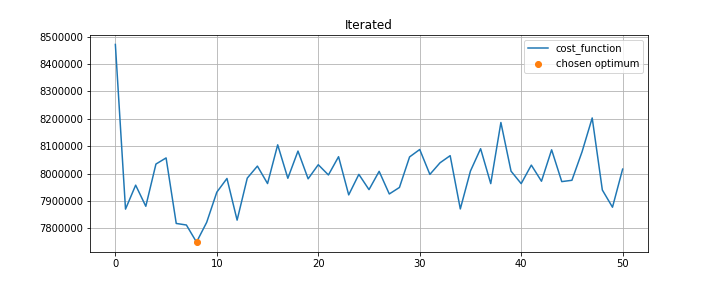
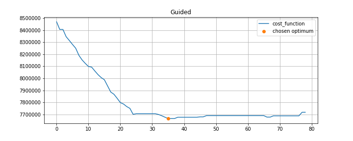

# LocalSearch
The research work on **local search** algorithms solving *Quadratic Assignment Problem*

*references:*
 - [Iterated local search for the quadratic assignment problem](https://archive.alvb.in/msc/04_infoea/seminar/papers/ILS_QAP_Stutzle.pdf )<br>
 - [ITERATED LOCAL SEARCH](https://sci2s.ugr.es/sites/default/files/files/Teaching/OtherPostGraduateCourses/Metaheuristicas/ILS.pdf) <br>
 - [GUIDED LOCAL SEARCH](https://www.bracil.net/CSP/papers/VTA-GLS-Handbook2010.pdf) and [here](https://www.researchgate.net/publication/220462500_Applying_an_Extended_Guided_Local_Search_to_the_Quadratic_Assignment_Problem#fullTextFileContent)

*best known results for tai benchmarks:*
- [see Page 6. TABLE IX](https://ink.library.smu.edu.sg/cgi/viewcontent.cgi?article=3668&context=sis_research)

## Cost function history for tai60a


---

### Benchmark: ```tai20a``` has **20** items and locations<br>
 - Best known solution cost: *703482* <br>
 - Initial solution cost: *873908* <br>
  - **Local Search** optimal cost **747858** ( exec time ```0.06``` seconds)
  - **Iterated Local Search** optimal cost **742752** ( exec time ```2.92``` seconds)
  - **Guided Local Search** optimal cost **717222** ( exec time ```0.65``` seconds)

---

### Benchmark: ```tai40a``` has **40** items and locations<br>
 - Best known solution cost: *3139370* <br>
 - Initial solution cost: *3853396* <br>
  - **Local Search** optimal cost **3481496** ( exec time ```0.16``` seconds)
  - **Iterated Local Search** optimal cost **3361050** ( exec time ```12.22``` seconds)
  - **Guided Local Search** optimal cost **3325712** ( exec time ```1.46``` seconds)

---

### Benchmark: ```tai60a``` has **60** items and locations<br>
 - Best known solution cost: *7205962* <br>
 - Initial solution cost: *8484364* <br>
  - **Local Search** optimal cost **7959112** ( exec time ```0.64``` seconds)
  - **Iterated Local Search** optimal cost **7754148** ( exec time ```22.11``` seconds)
  - **Guided Local Search** optimal cost **7656154** ( exec time ```3.82``` seconds)

---

### Benchmark: ```tai80a``` has **80** items and locations<br>
 - Best known solution cost: *13515450* <br>
 - Initial solution cost: *15707292* <br>
  - **Local Search** optimal cost **14924312** ( exec time ```0.78``` seconds)
  - **Iterated Local Search** optimal cost **14773828** ( exec time ```36.07``` seconds)
  - **Guided Local Search** optimal cost **14460422** ( exec time ```8.67``` seconds)

---

### Benchmark: ```tai100a``` has **100** items and locations<br>
 - Best known solution cost: *21054656* <br>
 - Initial solution cost: *24149696* <br>
  - **Local Search** optimal cost **23556992** ( exec time ```0.33``` seconds)
  - **Iterated Local Search** optimal cost **23037370** ( exec time ```51.95``` seconds)
  - **Guided Local Search** optimal cost **22139380** ( exec time ```20.34``` seconds)

# Comparison:
| benchmark    |   best_known_cost | algorithm   |   mean_alg_cost |   mean_exec_time |
|:-------------|------------------:|:------------|-----------:|------------:|
| data\tai20a  |            703482 | Guided      |     749870 |         0.2 |
| data\tai20a  |            703482 | Iterated    |     731518 |         2.9 |
| data\tai20a  |            703482 | LocalSearch |     763320 |         0.1 |
| data\tai40a  |           3139370 | Guided      |    3320935 |         1.5 |
| data\tai40a  |           3139370 | Iterated    |    3349834 |        12.5 |
| data\tai40a  |           3139370 | LocalSearch |    3430242 |         0.2 |
| data\tai60a  |           7205962 | Guided      |    7683911 |         3.9 |
| data\tai60a  |           7205962 | Iterated    |    7793235 |        23   |
| data\tai60a  |           7205962 | LocalSearch |    7979503 |         0.4 |
| data\tai80a  |          13515450 | Guided      |   14326908 |         9.6 |
| data\tai80a  |          13515450 | Iterated    |   14752530 |        34.1 |
| data\tai80a  |          13515450 | LocalSearch |   15053247 |         0.5 |
| data\tai100a |          21054656 | Guided      |   22197873 |        22.3 |
| data\tai100a |          21054656 | Iterated    |   23035250 |        50.2 |
| data\tai100a |          21054656 | LocalSearch |   23428402 |         1   |
